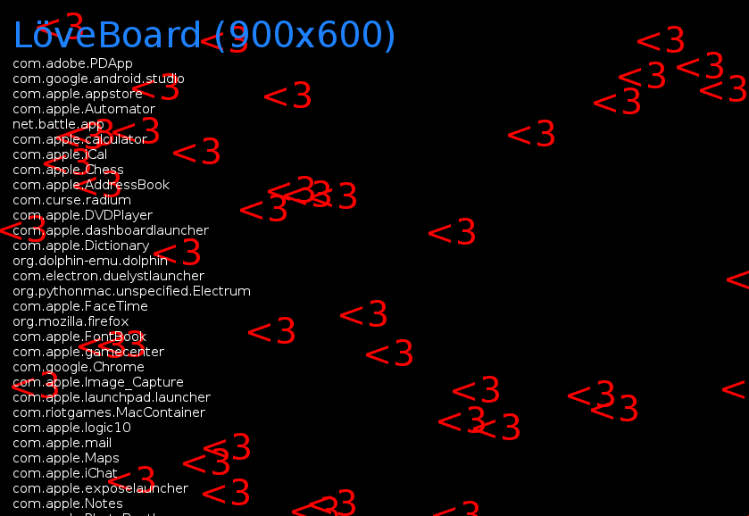

This is the game that is run when LoveBoard is hooked. It is the same as the game that is found in `/var/mobile/LoveBoard`.

This can also be run as a standalone Love2D game on desktop. Just open LÖVE.app with this repository.

